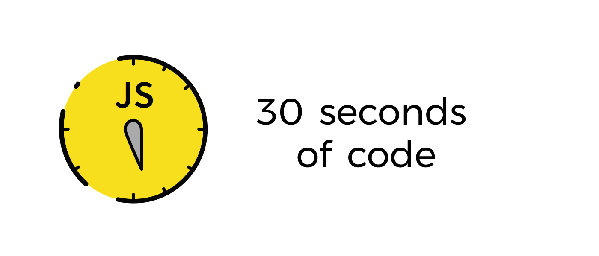

# 30-seconds-of-code
30 seconds of code 中文版翻译     https://github.com/30-seconds/30-seconds-of-code

---
> 收集有用的 Javascript 片段, 你可以在30秒或更少的时间里理解。

- 使用<kbd>Ctrl</kbd> + <kbd>F</kbd> 或 <kbd>command</kbd> + <kbd>F</kbd>搜索代码段。
- 代码段是在 ES6 中编写的, 请使用[Babel transpiler](https://babeljs.io/)确保向后兼容。

感谢作者分享了大量有用的Javascript片段,本文为中文版翻译。

原文：[https://github.com/30-seconds/30-seconds-of-code](https://github.com/30-seconds/30-seconds-of-code)

鉴于蔡宝坚作者的[https://github.com/kujian/30-seconds-of-code](https://github.com/kujian/30-seconds-of-code)中文翻译版不是很全，决定翻译其所有。

> 每日10个javascript小技巧 翻译，记录自己的学习过程，共同学习，共同交流  
>【注】：本人能力有限，如有翻译不当，欢迎指正。

## 最新记要
- 2019年8月19日 22:30:41 -- `Date`部分翻译完毕
- 2019年8月18日 21:41:34 -- `Browser`部分翻译完毕
- 2019年8月17日 21:26:43 -- 翻译更新至`Browser`的`on`方法
- 2019年8月16日 22:03:07 -- 翻译更新至`Browser`的`elementIsVisibleInViewport`方法
- 2019年8月15日 23:20:58 -- `Array`及`Adapter`之前遗漏部分翻译完毕
- 2019年8月14日 17:24:15 -- 翻译更新至`Array`的`unzipWith`方法 
- 2019年8月13日 22:16:30 -- 翻译更新至`Array`的`takeWhile`方法 
- 2019年8月12日 23:39:16 -- 翻译更新至`Array`的`sortedLastIndex`方法  
- 2019年8月12日 00:33:05 -- 翻译更新至`Array`的`reduceWhich`方法  
- 2019年8月10日 23:30:55 -- 翻译更新至`Array`的`nthElement`方法  
- 2019年8月9日 22:37:49 -- 翻译更新至`Array`的`intersectionWith`方法 
- 2019年8月9日 00:23:49 -- 翻译更新至`Array`的`head`方法

# 目录

- [🔌 Adapter](/lib/Adapter.md)
- [📚 Array](/lib/Array.md)
- [📚 Browser](/lib/Browser.md)
- [📚 Date](/lib/Date.md)

